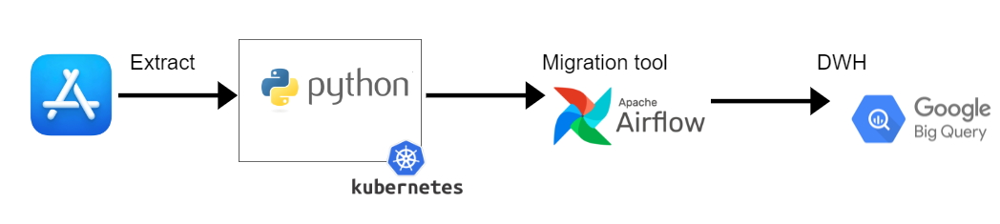
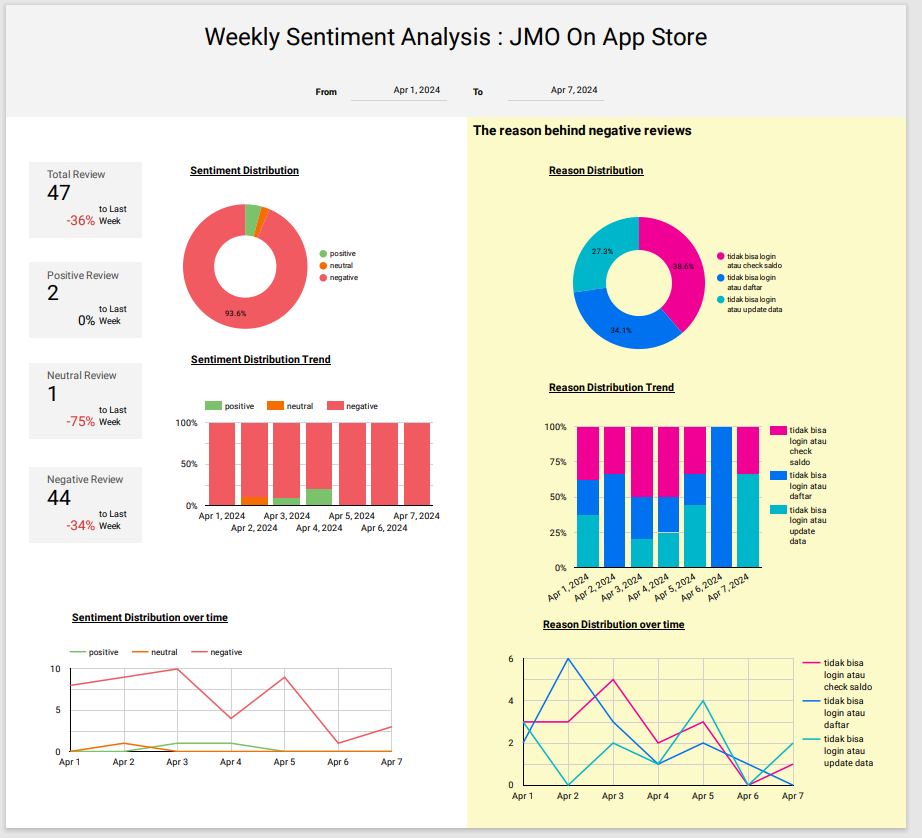

# Sentiment Analysis

## Table of Contents
* [About the Project](#about-the-project)
* [Getting Started](#getting-started)
    * [Prerequisites](#prerequisites)
    * [Installation](#Installation)
    * [Environment Variable](#environment-variable)
* [Dashboard](#dashboard)
* [Author](#author)

<!-- About THE PROJECT -->
## [About The Project](#about-the-project)

This project not only focuses on deriving insights but also on enhancing the app's functionality through technological advancements. By leveraging tools like Airflow and KubernetesPodOperator, we aim to streamline the ETL process, including tasks app store review scraping. Additionally, we apply the negative reviews to LDA model that we developed to identify reasons behind negative reviews. The KubernetesPodOperator is particularly valuable in avoiding dependency conflicts, ensuring smooth execution of tasks within the ETL pipeline.

Futhermore, leveraging the data stored in BigQuery will allow us to monitor key metrics through a dashboard.

### Infrastructure & Steps

1. Develop a module to collect review data from the App Store and use the LDA model to identify reasons for negative reviews
2. Build docker image
3. Kubernetes Operator generate a request
4. Kubernetes will launch your pod according to the specified specifications
5. Images will be loaded with all the necesssary config
6. After the job is executed, data is stored in BigQuery.

For model development, you can see the ipynb

## [Getting Started](#getting-started)

### [Prerequisites](#prerequisites)
* **Python 3.10+**

### [Installation](#Installation)
After clone the repo, follow instruction below
**Docker**
```
## Build
docker build . -t jmo_review:v1

## Run
## scrap data
# default only scrap data in the last 7 days
docker run -it jmo_review:v1 scrap-data
# or specify the date from which you want to start collecting data until the present
docker run -it jmo_review:v1 scrap-data '2024-01-01'

## generate reason behind negative review
# you get reason of the review that you recently scrapped
docker run -it jmo_review:v1 generate-reason

## tag
docker tag docker.io/library/jmo_review:v1 localhost:5001/jmo_review:v1

## push
docker push localhost:5001/jmo_review:v1

```
** Aiflow installation**
I provide this project with DAG file (jmo_scraper_etl.py) where the job will be executed every Monday at 7 AM, starting from scraping task to generating reason of negative reviews, but for installation instructions for Airflow and Kubernetes Setup, please visit the
[astro cli airflow](https://docs.astronomer.io/astro/cli/overview) and 
[kubernetespodoperator](https://docs.astronomer.io/learn/kubepod-operator)

### [Environment Variable](#environment-variable)
The project is configured via environment variables, i.e. file `.env` but we dont attach it here :P

## [Dashboard](#dashboard)
### Example Dashboard ###



## [Author](#author)
Deviyanti AM [linkedin](https://linkedin.com/in/deviyanti-am)